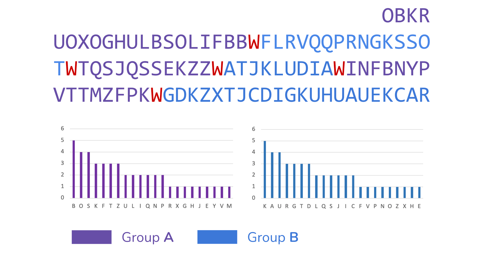

# K4nundrum

## About the Project

The [“Kryptos” sculpture](https://en.wikipedia.org/wiki/Kryptos), dedicated in 1990 by its creator Jim Sanborn, contains four encoded messages. Cryptography enthusiasts have successfully decoded three of them. However, the elusive fourth ciphertext, K4, remains undeciphered, presenting a fascinating challenge to the global community of cryptanalysts.

It remains one of the most famous unsolved codes.

The purpose of K4nundrum is to explore a hypothesis: what if K4 was a combination of several text segments combined with a letter not mapped to the plaintext?

K4nundrum uses letters as separators to split K4 into groups of text segments and assesses their similarities. Its main contribution is to have identified that, as far as K4 is concerned, the letter ‘W’ could act as a separator that generates two groups with the same letter frequency distribution shapes (assigned to different letters).



These findings are detailed in this blog post: *A Fresh Perspective on Kryptos K4, the Decades-Old Unsolved Code*.

Contributions are welcomed (`CONTRIBUTING.md`).

## Usage

### Analyze K4

Assuming that Go is installed on your system (if not: [how to install Go](https://go.dev/doc/install)), run:

```
$ go run ./...
```

This command analyzes the original K4.

Expected output:

```
> OBKRUOXOGHULBSOLIFBBWFLRVQQPRNGKSSOTWTQSJQSSEKZZWATJKLUDIAWINFBNYPVTTMZFPKWGDKZXTJCDIGKUHUAUEKCAR
  Separator: W

  Group 1:	INFBNYPVTTMZFPK OBKRUOXOGHULBSOLIFBB TQSJQSSEKZZ 
  Letter Freq.:	B:5  S:4  O:4  T:3  K:3  Z:3  F:3  U:2  I:2  Q:2  L:2  N:2  P:2  H:1  J:1  V:1  M:1  X:1  Y:1  R:1  G:1  E:1  

  Group 2:	ATJKLUDIA FLRVQQPRNGKSSOT GDKZXTJCDIGKUHUAUEKCAR 
  Letter Freq.:	K:5  U:4  A:4  R:3  D:3  T:3  G:3  C:2  S:2  Q:2  J:2  I:2  L:2  H:1  V:1  Z:1  F:1  E:1  O:1  X:1  P:1  N:1
```

### Run a Simulation

For statistical purposes, K4nundrum can also process random strings consisting of 97 uppercase letters (“pseudo-K4s”).

```
$ go run ./... --sim
```

When this mode is enabled, a file named `stats.txt`, generated in its root directory, is regularly updated. It keeps track of the following metrics:

* `Same distribution shapes`: identical letter frequency distribution shapes,
* `Groups length > 2`: appropriately sized group sizes (excluding groups with 1 or 2 characters),
* `Alternating groups`: groups that are alternating in the pseudo-K4s (example: `A|B|C|A|B|C|A|B|C`),
* `K4-like groups`: groups having all of the above characteristics, corresponding to K4-like groups (strings characterized by a pattern observed with K4).

The analyses run in parallel. The number of parallel workers (set to 20 by default) can be defined using the `--workers {{number}}` option.

`^C` terminates the simulation.

#### Statistics on the Generation of ~1 Million Pseudo-K4s

Here are some statistics from a simulation that generated and analyzed about 1 million pseudo-K4s in March 2024:

```
Same distribution shapes  1.74%	     17961/1031972
Groups length > 2         0.57%	      5923/1031972
Alternating groups        0.07%	       671/1031972
K4-like groups            0.04%	       458/1031972
```
